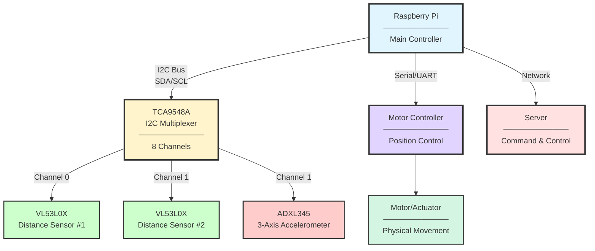
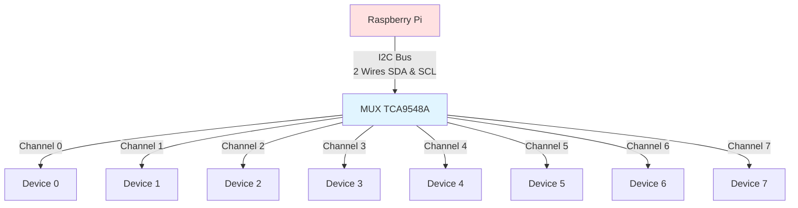
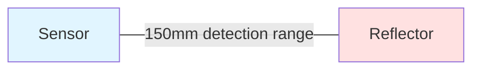
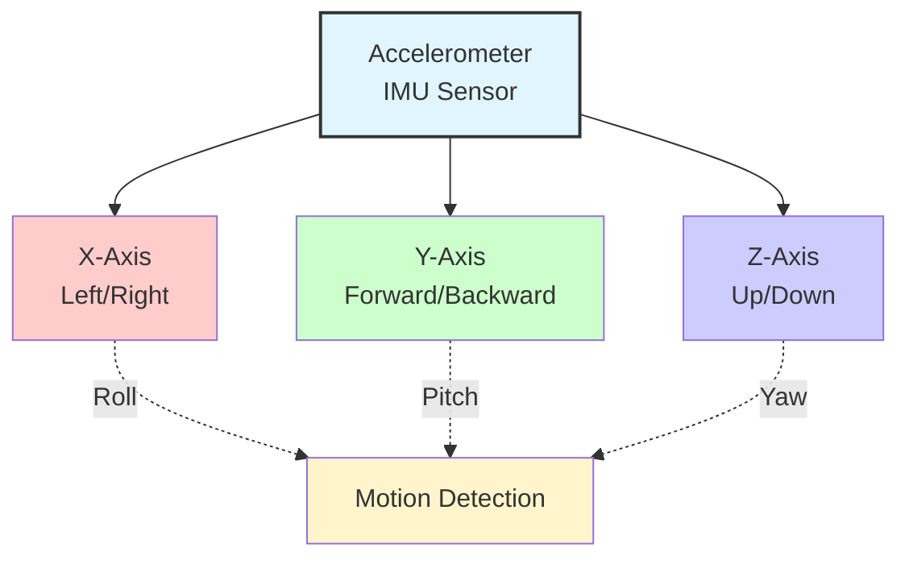
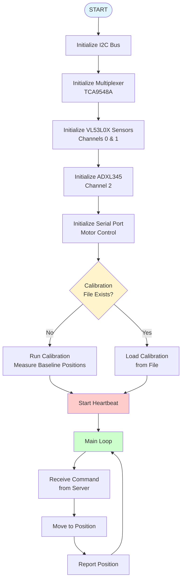

# Hardware Control System 

##  Table of Contents
1. [Directory Layout FIXME](#directory-layout)
2. [System Overview](#system-overview)
3. [Hardware Components](#hardware-components)
4. [Code Flow](#code-flow)
5. [Detailed Function Explanations](#detailed-function-explanations)
6. [Key Concepts](#key-concepts)


---
## Directory Layout FIXME
```bash
desk_controler/
├── src/
│   ├── __init__.py
│   ├── main.py                      # Main application entry point
│   ├── config.py                    # Configuration settings
│   ├── calibration.py               # Calibration script  
│   ├── motor_controller.py
│   ├── hardware/
│   │   ├── __init__.py
│   │   ├── i2c_utils.py             # I2C bus management
│   │   ├── sensors.py               # sensor setup
│   │   └── serial_comm.py           # Serial communiction setup
│   ├── utils/
│   │   ├── __init__.py
│   │   ├── misc.py                  # Miscalanious scripts
│   │   ├── timeout.py 			     # Timeout logic
│   │   └── heartbeat.py             # Heartbeat monitoring FIXME: DOES NOT EXIST YEY
├── tests/
│	├── test_hardware_system.py      # Unit tests for individual components
│	├── test_integration.py          # Integration tests with simulated hardware
│	├── pytest.ini                   # Pytest configuration
│	├── test_requirements.txt        # Test dependencies
│	├── run_tests.py                 # Test runner script
│	└── README_TESTS.md              # Tests documentation
├── docs/
│   ├── Troubleshooting_guide.md
│   ├── Calibration.md
│   └── Examples.md
├── requirements.txt                 # Python dependencies                      
└── README.md                        # Project documentation
```

## System Overview

This is a **hardware control application** that manages a motorized over the bed workstation with multiple sensors. The main functions of the application are:

- **Move to precise positions** using closed loop motor control
- **Measure distance** using time of flight sensors (Adafruit VL53L0X) via I2C
- **Measure angle** using an accelerometer (Adafruit ADXL345) via I2C
- **Calibrate itself** to apply offset and account for non-linear effects
- **Communicate** with existing control box via serial port and Home Assistant server via MQTT

## Hardware Architecture


**System Components:**

| Component | Function | Connection |
|-----------|----------|------------|
| **Raspberry Pi** | Main controller & processing | - |
| **TCA9548A** | I2C multiplexer (8 channels) | I2C Bus |
| **VL53L0X #1** | Distance sensor | Channel 0 |
| **VL53L0X #2** | Distance sensor | Channel 1 |
| **ADXL345** | 3-axis accelerometer | Channel 1 |
| **Motor Controller** | Position control | Serial/UART |
| **Server** | Remote command & monitoring | MQTT |

**Communication Protocols:**
- **I2C:** Sensor communication via multiplexer
- **Serial/UART:** Motor control commands
- **MQTT:** Server communication for remote control
---

## Hardware Components

### 1. **TCA9548A I2C Multiplexer**
- **What**: Eight Channel I2C Multiplexer
- **How it works**: Creates eight virtual I2C buses that can be addresses from a single main bus. This allows devices with identical I2C addresses to be on the same main bus.
- **Use case**: The I2C protocol only allows for one device with a certain address to be on any one bus. Because both the tine of flight sensors share the address 0x26, a multiplexer is needed to interface with both sensors. The accelerometer is also addressed through the mux for uniformity and ease on control in the code. Documentation from TI on the I2C protocol can be found [here](#https://www.ti.com/lit/an/sbaa565/sbaa565.pdf?ts=1770265206096&ref_url=https%253A%252F%252Fwww.bing.com%252F).
- **Docs**: Documentation can be found on the Adafruit website [here](#https://learn.adafruit.com/adafruit-tca9548a-1-to-8-i2c-multiplexer-breakout?view=all&gad_source=1&gad_campaignid=21079267614&gclid=Cj0KCQiAnJHMBhDAARIsABr7b86WEk41wAFa5H2wmGuvtGGEHgq5V8cepWBIAK4iaK4CBcwsfKq3ofsaAslNEALw_wcB).




>**Note:** The TCA9548A multiplexer allows multiple I2C devices with the same address to coexist on the bus by providing 8 independent channels. However in this project only channels 0, 1, and 2 are used.

### 2. **VL53L0X Distance Sensors (2x)**
- **What**: Laser time-of-flight distance sensors
- **Range**: ~30mm to 2000mm
- **Accuracy**: ±3% 
- **How it works**: Sends laser pulse, measures time for reflection
- **Use case**: Used as the feedback method for the monitor and keyboard height linear actuators
- **Docs**: Documentation can be found on the Adafruit website [here](#https://learn.adafruit.com/adafruit-vl53l0x-micro-lidar-distance-sensor-breakout).



### 3. **ADXL345 Accelerometer**
- **What**: 3-axis motion sensor (X, Y, Z)
- **Use case**: Detects if system is moving, tilted, or vibrating
- **Output**: Acceleration in g's (gravity units)
  - Stationary: (0, 0, 9.8) = gravity pulling down
  - Moving: Changes in X, Y, Z values
  - **Docs**: Documentation can be found on the Adafruit website [here](#https://www.adafruit.com/product/1231?gad_source=1&gad_campaignid=21079267614&gclid=Cj0KCQiAnJHMBhDAARIsABr7b86xpB53FGgP611S-nHp8bbQ6ZLXaWfghXusS2Xnw88LeZu_aI-UZJYaArQ8EALw_wcB).
  - 

>**Note**: FIXME add detail about only one axis being used

#### Angle calculation:
FIXME: add angle measurement equation

### 4. **Motor Controller (Serial Communication)**
-   **What**: interface between the Raspberry Pi and existing control box
-   **Interface**: Serial port (UART) - sends byte commands FIXME: add serial port name
-   **Commands**: Move, Stop, Set Position, etc. FIXME: Add commands from config .py

**Note**: Commands sent form the raspberry Pi to the control box toggle the function. If the box is given and 
extend command the actuator will not stop unless the stop command is given or the actuator runs into it upper limit.
## Code Flow

### Main Program Execution Flow


**Initialization Sequence:**
1. I2C Bus setup
2. TCA9548A multiplexer configuration
3. VL53L0X distance sensors (channels 0 & 1)
4. ADXL345 accelerometer (channel 1)
5. Serial port for motor control
6. Calibration data handling
7. Heartbeat monitoring

**Main Loop:**
- Continuously receives commands from server
- Executes position movements
- Reports current position back to server


---

## Detailed Function Explanations

### 1. `init_all_hardware()`

**Purpose**: Initialize all hardware components in the correct order
**Why this order matters:**
1. Must create I2C bus first (it's the communication highway)
2. Must initialize multiplexer second (it controls access to channels)
3. Then initialize individual sensors on their assigned channels

---

### 2. `calibrate_vl53_sensors(sensors)`

**Purpose**: Establish a "home" or "baseline" position for the system

**How it works:**
```python
# Conceptual flow: FIXME: not how the new function works
1. System is at unknown position
2. Take 10 distance readings from sensor
3. Average them to get baseline
   Example: [100, 101, 99, 100, 100, 101, 99, 100, 101, 100]
   Average: 100.1mm ← This is your "home position"
4. Save this to a file (calibration.json)
```

**Why calibration is needed:**
- Sensors measure absolute distance to nearest object
- But you want to know position **relative to a starting point**
- Calibration says "THIS is position zero"
- All future movements are relative to this

**Example:**
```
Calibration baseline: 100mm
Current reading: 150mm
→ You've moved 50mm from home position
```

---

### 3. `move_station_distance(sensors, sensor_name, target_mm, ser)`

**Purpose**: Move motor to an **absolute** distance reading

---

### 4. `move_station_distance_calibrated(sensors, calibration_data, sensor_name, relative_mm, ser)`

**Purpose**: Move **relative to the calibrated baseline**

**Why two movement functions?**
- `move_station_distance()` → "Go to 150mm" (absolute)
- `move_station_distance_calibrated()` → "Extend 50mm from home" (relative)

---

### 5. `move_to_retracted(sensors, sensor_name, ser)`

**Purpose**: Return to the fully retracted (home) position

---

### 6. `emergency_stop(ser)`

**Purpose**: Immediately halt all motor movement

---

### 7. `get_sensor_value(sensors, sensor_name)`

**Purpose**: Read current value from a specific sensor


## Safety Considerations

### 1. **Always Have an Emergency Stop**
```python
emergency_stop(ser)  # Must work instantly
```

### 2. **Validate Sensor Readings**
```python
if distance < MIN_SAFE or distance > MAX_SAFE:
    emergency_stop(ser)
    raise ValueError("Sensor reading out of safe range")
```

### 3. **Timeout on Movements**
```python
start_time = time.time()
while not at_target():
    if time.time() - start_time > TIMEOUT:
        emergency_stop(ser)
        raise TimeoutError("Movement took too long")
```

### 4. **Cleanup in Finally Block**
```python
try:
    # Risky operations
    move_motor()
finally:
    # Always execute, even if error
    ser.write(config.OFF)
```
