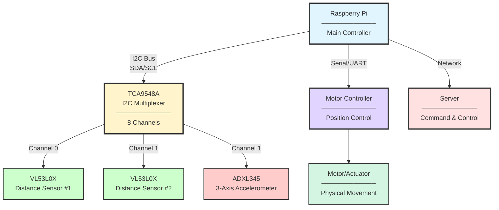
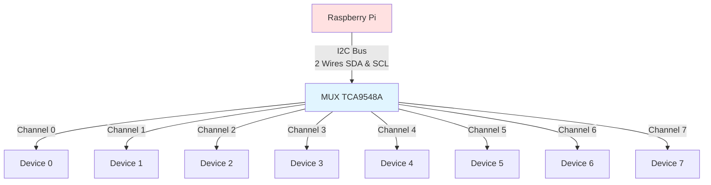
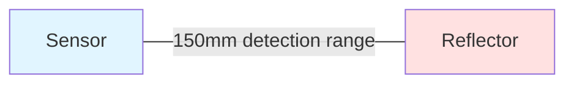
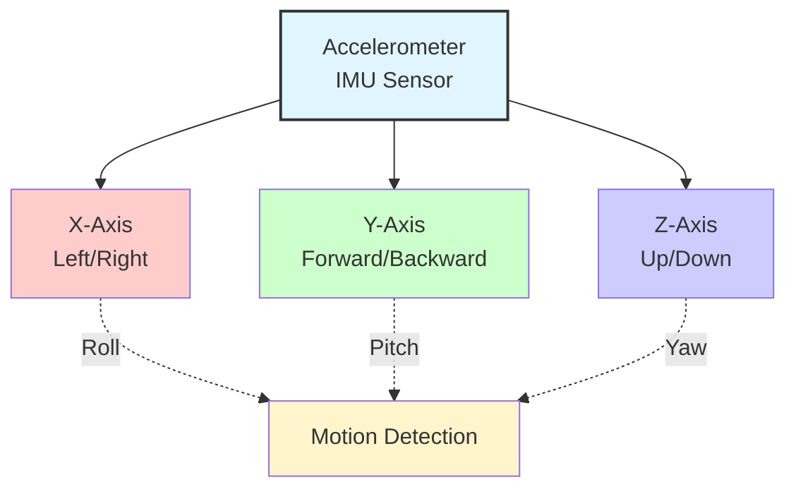
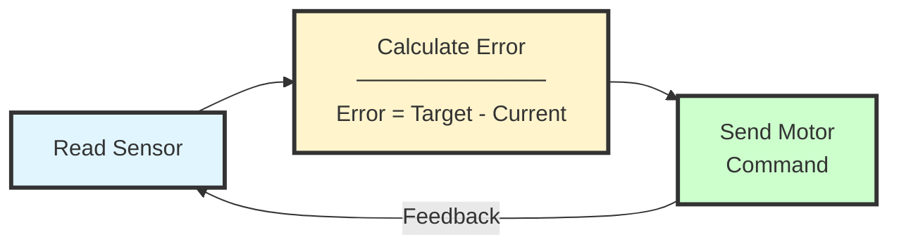

# Hardware Control System 

##  Table of Contents
1. [System Overview](#system-overview)
2. [Hardware Components](#hardware-components)
3. [Code Flow](#code-flow)
4. [Detailed Function Explanations](#detailed-function-explanations)
5. [Key Concepts](#key-concepts)
6. [Usage Examples](#usage-examples)

---

## System Overview

This is a **hardware control application** that manages a motorized over the bed workstation with multiple sensors. The main functions of the application are:

- **Move to precise positions** using closed loop motor control
- **Measure distance** using time of flight sensors (Adafruit VL53L0X) via I2C
- **Measure angle** using an accelerometer (Adafruit ADXL345) via I2C
- **Calibrate itself** to apply offset and account for non-linear effects
- **Communicate** with existing control box via serial port and Home Assistant server via MQTT

## Hardware Architecture


**System Components:**

| Component | Function | Connection |
|-----------|----------|------------|
| **Raspberry Pi** | Main controller & processing | - |
| **TCA9548A** | I2C multiplexer (8 channels) | I2C Bus |
| **VL53L0X #1** | Distance sensor | Channel 0 |
| **VL53L0X #2** | Distance sensor | Channel 1 |
| **ADXL345** | 3-axis accelerometer | Channel 1 |
| **Motor Controller** | Position control | Serial/UART |
| **Server** | Remote command & monitoring | MQTT |

**Communication Protocols:**
- **I2C:** Sensor communication via multiplexer
- **Serial/UART:** Motor control commands
- **MQTT:** Server communication for remote control
---

## Hardware Components

### 1. **TCA9548A I2C Multiplexer**
- **What**: Eight Channel I2C Multiplexer
- **How it works**: Creates eight virtual I2C buses that can be addresses from a single main bus. This allows devices with identical I2C addresses to be on the same main bus.
- **Use case**: The I2C protocol only allows for one device with a certain address to be on any one bus. Because both the tine of flight sensors share the address 0x26, a multiplexer is needed to interface with both sensors. The accelerometer is also addressed through the mux for uniformity and ease on control in the code. Documentation from TI on the I2C protocol can be found [here](#https://www.ti.com/lit/an/sbaa565/sbaa565.pdf?ts=1770265206096&ref_url=https%253A%252F%252Fwww.bing.com%252F).
- **Docs**: Documentation can be found on the Adafruit website [here](#https://learn.adafruit.com/adafruit-tca9548a-1-to-8-i2c-multiplexer-breakout?view=all&gad_source=1&gad_campaignid=21079267614&gclid=Cj0KCQiAnJHMBhDAARIsABr7b86WEk41wAFa5H2wmGuvtGGEHgq5V8cepWBIAK4iaK4CBcwsfKq3ofsaAslNEALw_wcB).




**Note:** The TCA9548A multiplexer allows multiple I2C devices with the same address to coexist on the bus by providing 8 independent channels. However in this project only channels 0, 1, and 2 are used.

### 2. **VL53L0X Distance Sensors (2x)**
- **What**: Laser time-of-flight distance sensors
- **Range**: ~30mm to 2000mm
- **Accuracy**: ±3% 
- **How it works**: Sends laser pulse, measures time for reflection
- **Use case**: Used as the feedback method for the monitor and keyboard height linear actuators
- **Docs**: Documentation can be found on the Adafruit website [here](#https://learn.adafruit.com/adafruit-vl53l0x-micro-lidar-distance-sensor-breakout).



### 3. **ADXL345 Accelerometer**
- **What**: 3-axis motion sensor (X, Y, Z)
- **Use case**: Detects if system is moving, tilted, or vibrating
- **Output**: Acceleration in g's (gravity units)
  - Stationary: (0, 0, 9.8) = gravity pulling down
  - Moving: Changes in X, Y, Z values
  - **Docs**: Documentation can be found on the Adafruit website [here](#https://www.adafruit.com/product/1231?gad_source=1&gad_campaignid=21079267614&gclid=Cj0KCQiAnJHMBhDAARIsABr7b86xpB53FGgP611S-nHp8bbQ6ZLXaWfghXusS2Xnw88LeZu_aI-UZJYaArQ8EALw_wcB).
  - 

**Note**: FIXME add detail about only one axis being used

#### Angle calculation:
FIXME: add angle measurement equation

### 4. **Motor Controller (Serial Communication)**
-   **What**: interface between the Raspberry Pi and existing control box
-   **Interface**: Serial port (UART) - sends byte commands FIXME: add serial port name
-   **Commands**: Move, Stop, Set Position, etc. FIXME: Add commands from config .py

**Note**: Commands sent form the raspberry Pi to the control box toggle the function. If the box is given and 
extend command the actuator will not stop unless the stop command is given or the actuator runs into it upper limit.

## Directory Layout FIXME
```
project-name/
├── src/
│   ├── __init__.py
│   ├── main.py                    # Main application entry point
│   ├── config/
│   │   ├── __init__.py
│   │   ├── settings.py            # Configuration settings
│   │   └── calibration.json       # Calibration data
│   ├── hardware/
│   │   ├── __init__.py
│   │   ├── i2c_manager.py         # I2C bus management
│   │   ├── multiplexer.py         # TCA9548A multiplexer
│   │   ├── vl53l0x_sensor.py      # Distance sensors
│   │   ├── adxl345_sensor.py      # Accelerometer
│   │   └── motor_controller.py    # Serial motor control
│   ├── core/
│   │   ├── __init__.py
│   │   ├── calibration.py         # Calibration routines
│   │   ├── position_controller.py # Position control logic
│   │   └── heartbeat.py           # Heartbeat monitoring
│   ├── communication/
│   │   ├── __init__.py
│   │   ├── server_client.py       # Server communication
│   │   └── protocol.py            # Command protocol
│   └── utils/
│       ├── __init__.py
│       ├── logger.py              # Logging utilities
│       └── helpers.py             # Helper functions
├── tests/
│   ├── __init__.py
│   ├── test_sensors.py
│   ├── test_calibration.py
│   └── test_motor_control.py
├── docs/
│   ├── hardware_setup.md
│   ├── calibration_guide.md
│   └── api_reference.md
├── requirements.txt               # Python dependencies
├── README.md                      # Project documentation
├── .gitignore
└── LICENSE
```

## Code Flow

### Main Program Execution Flow


**Initialization Sequence:**
1. I2C Bus setup
2. TCA9548A multiplexer configuration
3. VL53L0X distance sensors (channels 0 & 1)
4. ADXL345 accelerometer (channel 1)
5. Serial port for motor control
6. Calibration data handling
7. Heartbeat monitoring

**Main Loop:**
- Continuously receives commands from server
- Executes position movements
- Reports current position back to server


---

## Detailed Function Explanations

### 1. `init_all_hardware()`

**Purpose**: Initialize all hardware components in the correct order
**Why this order matters:**
1. Must create I2C bus first (it's the communication highway)
2. Must initialize multiplexer second (it controls access to channels)
3. Then initialize individual sensors on their assigned channels

---

### 2. `calibrate_vl53_sensors(sensors)`

**Purpose**: Establish a "home" or "baseline" position for the system

**How it works:**
```python
# Conceptual flow: FIXME: not how the new function works
1. System is at unknown position
2. Take 10 distance readings from sensor
3. Average them to get baseline
   Example: [100, 101, 99, 100, 100, 101, 99, 100, 101, 100]
   Average: 100.1mm ← This is your "home position"
4. Save this to a file (calibration.json)
```

**Why calibration is needed:**
- Sensors measure absolute distance to nearest object
- But you want to know position **relative to a starting point**
- Calibration says "THIS is position zero"
- All future movements are relative to this

**Example:**
```
Calibration baseline: 100mm
Current reading: 150mm
→ You've moved 50mm from home position
```

---

### 3. `move_station_distance(sensors, sensor_name, target_mm, ser)`

**Purpose**: Move motor to an **absolute** distance reading

---

### 4. `move_station_distance_calibrated(sensors, calibration_data, sensor_name, relative_mm, ser)`

**Purpose**: Move **relative to the calibrated baseline**

**Why two movement functions?**
- `move_station_distance()` → "Go to 150mm" (absolute)
- `move_station_distance_calibrated()` → "Extend 50mm from home" (relative)

---

### 5. `move_to_retracted(sensors, sensor_name, ser)`

**Purpose**: Return to the fully retracted (home) position

---

### 6. `emergency_stop(ser)`

**Purpose**: Immediately halt all motor movement

---

### 7. `get_sensor_value(sensors, sensor_name)`

**Purpose**: Read current value from a specific sensor

---

## Key Concepts

### 1. **I2C Communication**

```
┌──────────┐           ┌──────────┐
│ Computer │ ←──I2C──→ │  Sensor  │
└──────────┘           └──────────┘
     │
     └─ SDA (Data line)
     └─ SCL (Clock line)
```

- **SDA**: Bidirectional data
- **SCL**: Clock signal (timing)
- **Address**: Each device has a unique ID (e.g., 0x29, 0x53)
- Computer sends: "Hey device 0x29, give me a reading"

### 2. **Multiplexer Channels**

```
Without MUX:                    With MUX:
┌─────────┐                    ┌─────────┐
│ Device  │ 0x29               │ Device  │ 0x29
├─────────┤                    ├─────────┤
│ Device  │ 0x29 ← CONFLICT!   │ MUX Ch0 │ ─┐
└─────────┘                    ├─────────┤  │
                               │ Device  │ 0x29
                               ├─────────┤  │
                               │ MUX Ch1 │ ─┘
                               └─────────┘
```

The MUX acts like a railroad switch:
- Turn to Channel 0 → Talk to Sensor #1
- Turn to Channel 1 → Talk to Sensor #2

### 3. **Calibration Data Structure**

```json
{
  "vl53l0x_0": {
    "baseline_mm": 100.5,
    "offset": 0,
    "timestamp": 1638360000,
    "samples": 10
  },
  "vl53l0x_1": {
    "baseline_mm": 105.2,
    "offset": 0,
    "timestamp": 1638360000,
    "samples": 10
  }
}
```

**Fields:**
- `baseline_mm`: The "home" position distance
- `offset`: Additional correction factor
- `timestamp`: When calibration was done
- `samples`: How many readings were averaged

### 4. **Serial Communication**

```python
# Open serial port
ser = serial.Serial('/dev/ttyUSB0', 9600)

# Send command (bytes)
ser.write(b'\x01\x02\x03')  # Move command
ser.write(config.OFF)        # Stop command
```

**Common Serial Commands** (example):
- `b'\x01'` → Move forward
- `b'\x02'` → Move backward  
- `b'\x00'` → Stop
- `b'\x03\x64'` → Move to position 100

### 5. **Closed Loop Control Systems**
**Closed-Loop Control:**




**Closed-Loop Control System**

**Feedback Control:**
- Continuously monitors sensor readings
- Compares current position to target position
- Adjusts motor commands to minimize error

**Control Loop Process:**
1. **Read Sensor:** Get current position/state
2. **Calculate Error:** Determine difference between target and current position
3. **Send Motor Command:** Adjust motor based on calculated error
4. **Repeat:** Loop continuously for closed-loop control


---

## Usage Examples

### Example 1: Basic Initialization and Reading

```python
# Initialize everything
sensors = init_all_hardware()
ser = init_serial()

# Read a distance sensor
distance = get_sensor_value(sensors, 'vl53l0x_0')
print(f"Current distance: {distance}mm")

# Read accelerometer
accel = get_sensor_value(sensors, 'adxl345')
print(f"Acceleration: X={accel['x']}, Y={accel['y']}, Z={accel['z']}")
```

### Example 2: Calibration Workflow

```python
# Try to load existing calibration
calibration_data = load_calibration()

if calibration_data is None:
    # No calibration found - create new one
    print("Running calibration...")
    calibration_data = calibrate_vl53_sensors(sensors)
    print("Calibration complete!")
else:
    print("Loaded existing calibration")

# Show calibration info
print_calibration_info(calibration_data)
```

### Example 3: Controlled Movement

```python
# Move to absolute position
move_station_distance(sensors, 'vl53l0x_0', 150, ser)
# → Motor moves until sensor reads 150mm

# Move relative to home
move_station_distance_calibrated(sensors, calibration_data, 'vl53l0x_0', 50, ser)
# → Extends 50mm from calibrated baseline

# Return home
move_to_retracted(sensors, 'vl53l0x_0', ser)
# → Retracts to minimum safe position

# Emergency stop
emergency_stop(ser)
# → Immediate halt
```

### Example 4: Continuous Monitoring

```python
import time

while True:
    # Read both distance sensors
    dist1 = get_sensor_value(sensors, 'vl53l0x_0')
    dist2 = get_sensor_value(sensors, 'vl53l0x_1')
    
    # Read accelerometer
    accel = get_sensor_value(sensors, 'adxl345')
    
    # Print status
    print(f"Sensor 1: {dist1}mm | Sensor 2: {dist2}mm")
    print(f"Accel: X={accel['x']:.2f}g Y={accel['y']:.2f}g Z={accel['z']:.2f}g")
    
    # Check for problems
    if abs(dist1 - dist2) > 10:
        print("WARNING: Sensors disagree!")
        emergency_stop(ser)
    
    time.sleep(1)  # Wait 1 second
```

### Example 5: With Calibrated Readings

```python
# Get raw and calibrated readings
reading = get_calibrated_reading(sensors, 'vl53l0x_0', calibration_data)

print(f"Raw reading: {reading['raw_mm']}mm")
print(f"Baseline: {reading['baseline_mm']}mm")
print(f"Offset from baseline: {reading['offset_mm']}mm")

# Example output:
# Raw reading: 150mm
# Baseline: 100mm
# Offset from baseline: 50mm
# → You're 50mm extended from home position
```

---

## Common Patterns in the Code

### Pattern 1: Try-Except-Finally for Hardware

```python
try:
    # Initialize hardware
    sensors = init_all_hardware()
    ser = init_serial()
    
    # Do work...
    
except Exception as e:
    print(f"Error: {e}")
    return 1
    
finally:
    # Always turn off motor (safety!)
    ser.write(config.OFF)
```

**Why**: Hardware can fail unpredictably. Always clean up!

### Pattern 2: Sensor Reading with Error Handling

```python
try:
    value = get_sensor_value(sensors, 'vl53l0x_0')
except Exception:
    # Sensor failed - use safe default or stop
    emergency_stop(ser)
    raise
```

### Pattern 3: Closed-Loop Control

```python
while True:
    current = get_sensor_value(sensors, 'vl53l0x_0')
    error = target - current
    
    if abs(error) < tolerance:
        break  # Close enough!
    
    # Send movement command proportional to error
    move_command = calculate_command(error)
    ser.write(move_command)
```

---

## Safety Considerations

### 1. **Always Have an Emergency Stop**
```python
emergency_stop(ser)  # Must work instantly
```

### 2. **Validate Sensor Readings**
```python
if distance < MIN_SAFE or distance > MAX_SAFE:
    emergency_stop(ser)
    raise ValueError("Sensor reading out of safe range")
```

### 3. **Timeout on Movements**
```python
start_time = time.time()
while not at_target():
    if time.time() - start_time > TIMEOUT:
        emergency_stop(ser)
        raise TimeoutError("Movement took too long")
```

### 4. **Cleanup in Finally Block**
```python
try:
    # Risky operations
    move_motor()
finally:
    # Always execute, even if error
    ser.write(config.OFF)
```

---

## Troubleshooting Guide

### Problem: "I2C device not found"
**Cause**: Wiring issue or wrong address
**Fix**: 
- Check SDA/SCL connections
- Run `i2cdetect -y 1` (on Raspberry Pi)
- Verify device address in config

### Problem: "Sensors give wildly different readings"
**Cause**: One sensor is faulty or misaligned
**Fix**:
- Check sensor #2 isn't reading a different object
- Recalibrate both sensors
- Replace faulty sensor

### Problem: "Motor moves but doesn't stop at target"
**Cause**: Closed-loop control not working
**Fix**:
- Verify sensor updates during movement
- Check serial communication
- Add debug prints to see current position

### Problem: "Calibration file not found"
**Cause**: First run, no calibration saved
**Fix**: 
- Run calibration: `calibrate_vl53_sensors(sensors)`
- It will create calibration.json automatically


