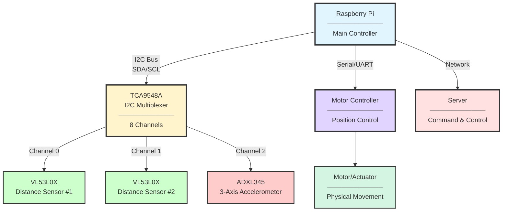
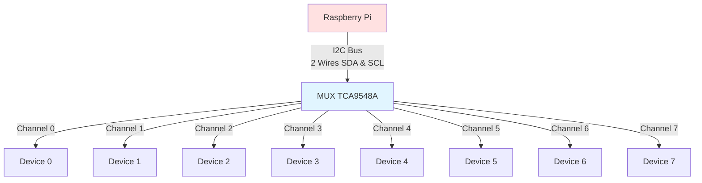
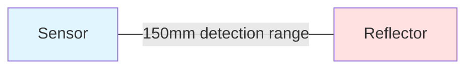
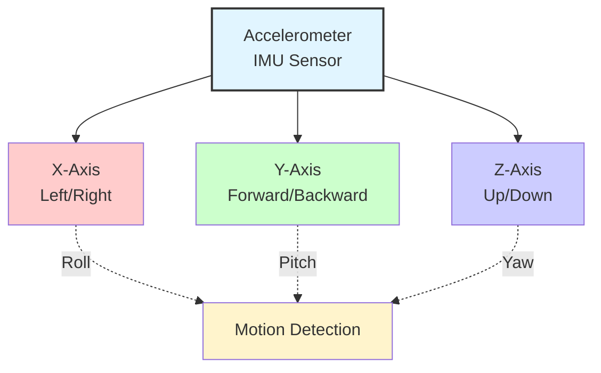
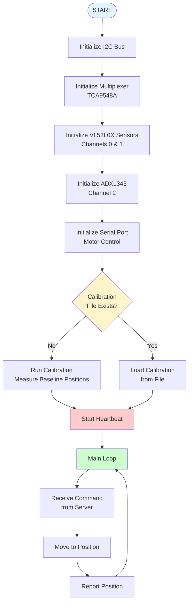

# Hardware Control System

## Table of Contents
1. [Directory Layout](#directory-layout)
2. [System Overview](#system-overview)
3. [Hardware Components](#hardware-components)
4. [Code Flow](#code-flow)
5. [Detailed Function Explanations](#detailed-function-explanations)
6. [Key Concepts](#key-concepts)
7. [Related Documentation](#related-documentation)


---
## Directory Layout
```
desk_controler/
├── src/
│   ├── __init__.py
│   ├── main.py                      # Main application entry point
│   ├── config.py                    # Configuration settings & motor commands
│   ├── calibration.py               # VL53L0X calibration script
│   ├── motor_control.py             # Motor control logic
│   ├── desk_controller_wrapper.py   # High-level control wrapper
│   ├── desk_controller_service.py   # Background service runner
│   ├── MQTT.py                      # MQTT client integration
│   ├── hardware/
│   │   ├── __init__.py
│   │   ├── i2c_utils.py             # I2C bus management
│   │   ├── sensors.py               # Sensor setup & reading
│   │   └── serial_comm.py           # Serial communication setup
│   └── utils/
│       ├── __init__.py
│       ├── misc.py                  # Angle conversion helpers
│       └── timeout.py               # Timeout logic
├── tests/
│   ├── test_hardware_system.py      # Unit tests for individual components
│   ├── test_integration.py          # Integration tests with simulated hardware
│   ├── test_desk_controller_wrapper_mqtt_async.py
│   ├── test_mqtt_config_loading.py
│   ├── test_config_motor_sensor_mapping.py
│   ├── test_motor_control_retract_minimum.py
│   ├── test_drift.py
│   ├── pytest.ini                   # Pytest configuration
│   ├── test_requirements.txt        # Test dependencies
│   ├── run_tests.py                 # Test runner script
│   └── README.md                    # Tests documentation
├── docs/
│   ├── quickstart_guide.md          # Step-by-step setup guide
│   ├── Calibration.md               # Calibration procedures
│   ├── Examples.md                  # Usage examples
│   ├── Key_concepts.md              # Core concepts explained
│   └── Troubleshooting Guide.md     # Troubleshooting reference
├── requirements.txt                 # Python dependencies
└── README.md                        # This file
```

## System Overview

This is a **hardware control application** that manages a motorized over the bed workstation with multiple sensors. The main functions of the application are:

- **Move to precise positions** using closed loop motor control
- **Measure distance** using time of flight sensors (Adafruit VL53L0X) via I2C
- **Measure angle** using an accelerometer (Adafruit ADXL345) via I2C
- **Calibrate itself** to apply offset and account for non-linear effects
- **Communicate** with existing control box via serial port and Home Assistant server via MQTT

## Hardware Architecture

```mermaid
graph TD
    RPI["Raspberry Pi<br/>────────────<br/>Main Controller"]
    
    RPI -->|I2C Bus<br/>SDA/SCL| MUX["TCA9548A<br/>I2C Multiplexer<br/>────────────<br/>8 Channels"]
    RPI -->|Serial/UART| MOTOR["Motor Controller<br/>────────────<br/>Position Control"]
    RPI -->|Network| SERVER["Server<br/>────────────<br/>Command & Control"]
    
    MUX -->|Channel 0| VL1["VL53L0X<br/>Distance Sensor #1"]
    MUX -->|Channel 1| VL2["VL53L0X<br/>Distance Sensor #2"]
    MUX -->|Channel 2| ACCEL["ADXL345<br/>3-Axis Accelerometer"]
    
    MOTOR --> ACTUATOR["Motor/Actuator<br/>────────────<br/>Physical Movement"]
    
    style RPI fill:#e1f5ff,stroke:#333,stroke-width:3px
    style MUX fill:#fff4cc,stroke:#333,stroke-width:3px
    style VL1 fill:#ccffcc,stroke:#333,stroke-width:2px
    style VL2 fill:#ccffcc,stroke:#333,stroke-width:2px
    style ACCEL fill:#ffcccc,stroke:#333,stroke-width:2px
    style MOTOR fill:#e1d5ff,stroke:#333,stroke-width:3px
    style SERVER fill:#ffe1e1,stroke:#333,stroke-width:3px
    style ACTUATOR fill:#d5f5e3,stroke:#333,stroke-width:2px
```

**System Components:**

| Component | Function | Connection |
|-----------|----------|------------|
| **Raspberry Pi** | Main controller & processing | - |
| **TCA9548A** | I2C multiplexer (8 channels) | I2C Bus |
| **VL53L0X #1** | Distance sensor | Channel 0 |
| **VL53L0X #2** | Distance sensor | Channel 1 |
| **ADXL345** | 3-axis accelerometer | Channel 2 |
| **Motor Controller** | Position control | Serial/UART |
| **Server** | Remote command & monitoring | MQTT |

**Communication Protocols:**
- **I2C:** Sensor communication via multiplexer
- **Serial/UART:** Motor control commands
- **MQTT:** Server communication for remote control
---

## Hardware Components

### 1. **TCA9548A I2C Multiplexer**
- **What**: Eight Channel I2C Multiplexer
- **How it works**: Creates eight virtual I2C buses that can be addresses from a single main bus. This allows devices with identical I2C addresses to be on the same main bus.
- **Use case**: The I2C protocol only allows for one device with a certain address to be on any one bus. Because both the tine of flight sensors share the address 0x26, a multiplexer is needed to interface with both sensors. The accelerometer is also addressed through the mux for uniformity and ease on control in the code. Documentation from TI on the I2C protocol can be found [here](#https://www.ti.com/lit/an/sbaa565/sbaa565.pdf?ts=1770265206096&ref_url=https%253A%252F%252Fwww.bing.com%252F).
- **Docs**: Documentation can be found on the Adafruit website [here](#https://learn.adafruit.com/adafruit-tca9548a-1-to-8-i2c-multiplexer-breakout?view=all&gad_source=1&gad_campaignid=21079267614&gclid=Cj0KCQiAnJHMBhDAARIsABr7b86WEk41wAFa5H2wmGuvtGGEHgq5V8cepWBIAK4iaK4CBcwsfKq3ofsaAslNEALw_wcB).



```mermaid
graph TD
    A[Raspberry Pi] -->|I2C Bus<br/>2 Wires SDA & SCL| B[MUX TCA9548A]
    B -->|Channel 0| C0[Device 0]
    B -->|Channel 1| C1[Device 1]
    B -->|Channel 2| C2[Device 2]
    B -->|Channel 3| C3[Device 3]
    B -->|Channel 4| C4[Device 4]
    B -->|Channel 5| C5[Device 5]
    B -->|Channel 6| C6[Device 6]
    B -->|Channel 7| C7[Device 7]
    
    style B fill:#e1f5ff
    style A fill:#ffe1e1
```

>**Note:** The TCA9548A multiplexer allows multiple I2C devices with the same address to coexist on the bus by providing 8 independent channels. However in this project only channels 0, 1, and 2 are used.

### 2. **VL53L0X Distance Sensors (2x)**
- **What**: Laser time-of-flight distance sensors
- **Range**: ~30mm to 2000mm
- **Accuracy**: ±3% 
- **How it works**: Sends laser pulse, measures time for reflection
- **Use case**: Used as the feedback method for the monitor and keyboard height linear actuators


```mermaid 
graph LR 
A[Sensor]  ---|150mm detection range| B[Reflector] 

style A fill:#e1f5ff
style B fill:#ffe1e1
```

### 3. **ADXL345 Accelerometer**
- **What**: 3-axis motion sensor (X, Y, Z)
- **Use case**: Detects if system is moving, tilted, or vibrating
- **Output**: Acceleration in g's (gravity units)
  - Stationary: (0, 0, 9.8) = gravity pulling down
  - Moving: Changes in X, Y, Z values


```mermaid
graph TD
    A[Accelerometer<br/>IMU Sensor] --> X[X-Axis<br/>Left/Right]
    A --> Y[Y-Axis<br/>Forward/Backward]
    A --> Z[Z-Axis<br/>Up/Down]
    
    X -.->|Roll| M[Motion Detection]
    Y -.->|Pitch| M
    Z -.->|Yaw| M
    
    style A fill:#e1f5ff,stroke:#333,stroke-width:2px
    style X fill:#ffcccc
    style Y fill:#ccffcc
    style Z fill:#ccccff
    style M fill:#fff4cc
```
>**Note**: Only the Z-axis is used for tilt angle measurement. The X and Y axes are not used in this application.

#### Angle calculation

The Z-axis acceleration reading is converted to a tilt angle using the following formula:

```
angle = 180° − arccos( clamp(z / g, −1, 1) )
```

Where:
- `z` = Z-axis acceleration in m/s²
- `g` = gravitational acceleration (9.81 m/s²)
- `clamp(v, −1, 1)` = clips the ratio to the valid domain of arccos

**Angle convention:**

| Z-axis reading | Angle |
|----------------|-------|
| Z ≈ −g (upside down) | 0° |
| Z ≈ 0 (perpendicular to ground) | 90° |
| Z ≈ +g (right-side up) | 180° |

Safe operating range: **60° – 120°** (configurable via `MIN_ANGLE_DEG` / `MAX_ANGLE_DEG` in `config.py`)

### 4. **Motor Controller (Serial Communication)**
-   **What**: Interface between the Raspberry Pi and the existing control box
-   **Interface**: Serial port (UART) — `/dev/serial0` at **2400 baud**
-   **Commands**: 3-byte packets with header `0x5A`, command byte, and checksum

**Motor Command Reference** (from `config.py`):

| Constant | Bytes | Action |
|----------|-------|--------|
| `CMD_ALL_OFF` | `5A 00 5A` | Stop all motors |
| `CMD_M1_EXTEND` | `5A 01 5B` | Motor 1 extend (OUT) |
| `CMD_M1_RETRACT` | `5A 02 5C` | Motor 1 retract (IN) |
| `CMD_M2_EXTEND` | `5A 04 5E` | Motor 2 extend (OUT) |
| `CMD_M2_RETRACT` | `5A 08 62` | Motor 2 retract (IN) |
| `CMD_M3_EXTEND` | `5A 10 6A` | Motor 3 extend (OUT) |
| `CMD_M3_RETRACT` | `5A 20 7A` | Motor 3 retract (IN) |

**Sensor → Motor mapping:**

| Sensor | Motor | Direction logic |
|--------|-------|-----------------|
| `adxl345` | Motor 1 | Z-axis angle controls tilt |
| `vl53l0x_0` | Motor 2 | Distance controls height #1 |
| `vl53l0x_1` | Motor 3 | Distance controls height #2 |

> **Note**: Commands sent from the Raspberry Pi to the control box toggle the function. If the box receives an extend command the actuator will not stop unless a stop command is issued or the actuator reaches its upper limit.
## Code Flow

### Main Program Execution Flow

```mermaid
flowchart TD
    START([START]) --> A[Initialize I2C Bus]
    A --> B[Initialize Multiplexer<br/>TCA9548A]
    B --> C[Initialize VL53L0X Sensors<br/>Channels 0 & 1]
    C --> D[Initialize ADXL345<br/>Channel 2]
    D --> E[Initialize Serial Port<br/>Motor Control]
    E --> F{Calibration<br/>File Exists?}
    
    F -->|No| G[Run Calibration<br/>Measure Baseline Positions]
    F -->|Yes| H[Load Calibration<br/>from File]
    
    G --> I[Start Heartbeat]
    H --> I
    
    I --> J[Main Loop]
    J --> K[Receive Command<br/>from Server]
    K --> L[Move to Position]
    L --> M[Report Position]
    M --> J
    
    style START fill:#e1f5ff
    style F fill:#fff4cc
    style J fill:#ccffcc
    style I fill:#ffcccc
```

**Initialization Sequence:**
1. I2C Bus setup
2. TCA9548A multiplexer configuration
3. VL53L0X distance sensors (channels 0 & 1)
4. ADXL345 accelerometer (channel 1)
5. Serial port for motor control
6. Calibration data handling
7. Heartbeat monitoring

**Main Loop:**
- Continuously receives commands from server
- Executes position movements
- Reports current position back to server


---

## Detailed Function Explanations

### 1. `init_all_hardware()`

**Purpose**: Initialize all hardware components in the correct order
**Why this order matters:**
1. Must create I2C bus first (it's the communication highway)
2. Must initialize multiplexer second (it controls access to channels)
3. Then initialize individual sensors on their assigned channels

---

### 2. `calibrate_vl53_sensors(sensors)`

**Purpose**: Establish a software offset so all subsequent distance readings are corrected relative to a known reference position.

**How it works:**
```
1. System must be at fully retracted position (known distance = 0 mm)
2. Take 30 distance readings from each VL53L0X sensor
3. Average them to get a raw baseline
   Example samples: [121, 121, 120, 121, 122, ...]
   Average raw reading: 121.3 mm
4. Calculate offset: offset = -(raw_average - known_distance) = -121.3 mm
5. Save offsets to config.OFFSET and persist to config.py
```

**Why calibration is needed:**
- Sensors measure absolute distance to the nearest object
- You want to know position **relative to the fully retracted position**
- Calibration establishes what reading corresponds to position zero
- The software offset is then applied to every subsequent reading

**Example:**
```
Raw average at retracted position: 121 mm
Calculated offset: -121 mm

Later — raw reading: 171 mm
Corrected reading: 171 + (-121) = 50 mm
→ You've extended 50 mm from the retracted position
```

---

### 3. `move_to_distance(sensors, sensor_name, target_mm, ser)`

**Purpose**: Move an actuator to an **absolute** corrected distance reading using closed-loop control.

---

### 4. `move_to_angle(sensors, target_deg, ser)`

**Purpose**: Move the tilt actuator to a target **angle in degrees** using ADXL345 feedback.

---

### 5. `retract_fully(sensors, sensor_name, ser)`

**Purpose**: Return to the fully retracted (home) position

---

### 6. `emergency_stop(ser)`

**Purpose**: Immediately halt all motor movement by sending `CMD_ALL_OFF`

---

### 7. `get_sensor_value(sensors, sensor_name)`

**Purpose**: Read current value from a specific sensor

- Returns **mm** (int) for VL53L0X distance sensors
- Returns **degrees** (float) for the ADXL345 tilt sensor


## Safety Considerations

### 1. **Always Have an Emergency Stop**
```python
emergency_stop(ser)  # Must work instantly
```

### 2. **Validate Sensor Readings**
```python
if distance < MIN_SAFE or distance > MAX_SAFE:
    emergency_stop(ser)
    raise ValueError("Sensor reading out of safe range")
```

### 3. **Timeout on Movements**
```python
start_time = time.time()
while not at_target():
    if time.time() - start_time > TIMEOUT:
        emergency_stop(ser)
        raise TimeoutError("Movement took too long")
```

### 4. **Cleanup in Finally Block**
```python
try:
    # Risky operations
    move_motor()
finally:
    # Always execute, even if error
    ser.write(config.OFF)
```
## Related Documentation

- [Quick Start Guide](docs/quickstart_guide.md) — Get up and running in 15 minutes
- [Calibration Guide](docs/Calibration.md) — Sensor calibration procedures
- [Examples](docs/Examples.md) — Usage examples and common patterns
- [Key Concepts](docs/Key_concepts.md) — I2C, multiplexers, angle sensing explained
- [Troubleshooting Guide](docs/Troubleshooting%20Guide.md) — Common issues and solutions
- [Test Suite Documentation](tests/README.md) — Testing guide
- [Adafruit CircuitPython](https://docs.circuitpython.org/) — Library documentation
- [VL53L0X Datasheet](https://www.st.com/resource/en/datasheet/vl53l0x.pdf)
- [ADXL345 Datasheet](https://www.analog.com/media/en/technical-documentation/data-sheets/ADXL345.pdf)
- [I2C Protocol Overview (TI)](https://www.ti.com/lit/an/sbaa565/sbaa565.pdf)


