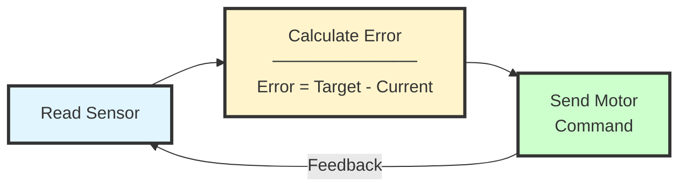

## Key Concepts

### 1. **I2C Communication**

```
┌──────────┐           ┌──────────┐
│ Computer │ ←──I2C──→ │  Sensor  │
└──────────┘           └──────────┘
     │
     └─ SDA (Data line)
     └─ SCL (Clock line)
```

- **SDA**: Bidirectional data
- **SCL**: Clock signal (timing)
- **Address**: Each device has a unique ID (e.g., 0x29, 0x53)
- Computer sends: "Hey device 0x29, give me a reading"

### 2. **Multiplexer Channels**

```
Without MUX:                    With MUX:
┌─────────┐                    ┌─────────┐
│ Device  │ 0x29               │ Device  │ 0x29
├─────────┤                    ├─────────┤
│ Device  │ 0x29 ← CONFLICT!   │ MUX Ch0 │ ─┐
└─────────┘                    ├─────────┤  │
                               │ Device  │ 0x29
                               ├─────────┤  │
                               │ MUX Ch1 │ ─┘
                               └─────────┘
```

The MUX acts like a railroad switch:
- Turn to Channel 0 → Talk to Sensor #1
- Turn to Channel 1 → Talk to Sensor #2


### 4. **Serial Communication**

```python
# Open serial port
ser = serial.Serial('/dev/ttyUSB0', 9600)

# Send command (bytes)
ser.write(b'\x01\x02\x03')  # Move command
ser.write(config.OFF)        # Stop command
```

**Common Serial Commands** (example):
- `b'\x01'` → Move forward
- `b'\x02'` → Move backward  
- `b'\x00'` → Stop
- `b'\x03\x64'` → Move to position 100

### 5. **Closed Loop Control Systems**
**Closed-Loop Control:**




**Closed-Loop Control System**

**Feedback Control:**
- Continuously monitors sensor readings
- Compares current position to target position
- Adjusts motor commands to minimize error

**Control Loop Process:**
1. **Read Sensor:** Get current position/state
2. **Calculate Error:** Determine difference between target and current position
3. **Send Motor Command:** Adjust motor based on calculated error
4. **Repeat:** Loop continuously for closed-loop control


> Written with [StackEdit](https://stackedit.io/).
