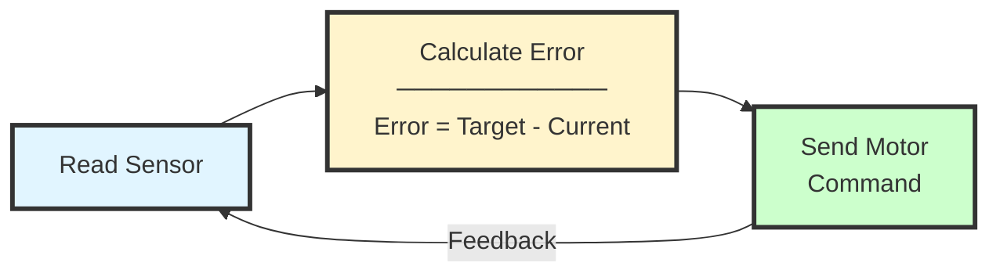

# Key Concepts

Core concepts behind the Automated Desk Controller hardware and software.

## Table of Contents

- [I2C Communication](#1-i2c-communication)
- [Multiplexer Channels](#2-multiplexer-channels)
- [Angle Measurement](#3-angle-measurement)
- [Serial Communication](#4-serial-communication)
- [Closed-Loop Control Systems](#5-closed-loop-control-systems)

---

## Key Concepts

### 1. **I2C Communication**

```
┌──────────┐           ┌──────────┐
│ Computer │ ←──I2C──→ │  Sensor  │
└──────────┘           └──────────┘
     │
     └─ SDA (Data line)
     └─ SCL (Clock line)
```

- **SDA**: Bidirectional data
- **SCL**: Clock signal (timing)
- **Address**: Each device has a unique ID (e.g., 0x29, 0x53)
- Computer sends: "Hey device 0x29, give me a reading"

### 2. **Multiplexer Channels**

```
Without MUX:                    With MUX:
┌─────────┐                    ┌─────────┐
│ Device  │ 0x29               │ Device  │ 0x29
├─────────┤                    ├─────────┤
│ Device  │ 0x29 ← CONFLICT!   │ MUX Ch0 │ ─┐
└─────────┘                    ├─────────┤  │
                               │ Device  │ 0x29
                               ├─────────┤  │
                               │ MUX Ch1 │ ─┘
                               └─────────┘
```

The MUX acts like a railroad switch:
- Turn to Channel 0 → Talk to Sensor #1
- Turn to Channel 1 → Talk to Sensor #2

### 3. **Angle Measurement**

The ADXL345 accelerometer measures acceleration along the X, Y, and Z axes.
In this project, **only the Z axis** is used to detect tilt angle.

When the sensor is stationary, the Z axis reads the component of gravity
along that axis. This gives a tilt angle using:

```
angle = 180° − arccos( clamp(z / g, −1, 1) )
```

Where:
- `z` = Z-axis acceleration (m/s²)
- `g` = 9.81 m/s² (gravitational acceleration)
- `clamp(v, −1, 1)` = clips the ratio to the valid domain of arccos

**Angle convention:**

| Physical orientation | Z reading | Angle |
|----------------------|-----------|-------|
| Sensor upside down | Z ≈ −g | 0° |
| Sensor perpendicular to ground | Z ≈ 0 | 90° |
| Sensor right-side up | Z ≈ +g | 180° |

This is implemented in `utils/misc.py` → `z_axis_to_degrees()`.

The safe operating range for the tilt actuator is **60° – 120°**,
configured in `config.MIN_ANGLE_DEG` and `config.MAX_ANGLE_DEG`.

### 4. **Serial Communication**

```python
# Open serial port
ser = serial.Serial('/dev/serial0', 2400)

# Send command (bytes)
ser.write(b'\x5a\x00\x5a')  # CMD_ALL_OFF — stop all motors
ser.write(b'\x5a\x01\x5b')  # CMD_M1_EXTEND — Motor 1 extend
```

**Command format** — 3-byte packets:

| Byte | Value | Description |
|------|-------|-------------|
| Byte 0 | `0x5A` | Header (fixed) |
| Byte 1 | command | See `config.py` |
| Byte 2 | checksum | Header + command |

**Motor command reference:**

| Constant | Bytes | Action |
|----------|-------|--------|
| `CMD_ALL_OFF` | `5A 00 5A` | Stop all motors |
| `CMD_M1_EXTEND` | `5A 01 5B` | Motor 1 extend |
| `CMD_M1_RETRACT` | `5A 02 5C` | Motor 1 retract |
| `CMD_M2_EXTEND` | `5A 04 5E` | Motor 2 extend |
| `CMD_M2_RETRACT` | `5A 08 62` | Motor 2 retract |
| `CMD_M3_EXTEND` | `5A 10 6A` | Motor 3 extend |
| `CMD_M3_RETRACT` | `5A 20 7A` | Motor 3 retract |

### 5. **Closed Loop Control Systems**
**Closed-Loop Control:**



```mermaid
graph LR
    A["Read Sensor"] --> B["Calculate Error<br/>────────────<br/>Error = Target - Current"]
    B --> C["Send Motor<br/>Command"]
    C --> |Feedback| A
    
    style A fill:#e1f5ff,stroke:#333,stroke-width:3px
    style B fill:#fff4cc,stroke:#333,stroke-width:3px
    style C fill:#ccffcc,stroke:#333,stroke-width:3px
```

**Closed-Loop Control System**

**Feedback Control:**
- Continuously monitors sensor readings
- Compares current position to target position
- Adjusts motor commands to minimize error

**Control Loop Process:**
1. **Read Sensor:** Get current position/state
2. **Calculate Error:** Determine difference between target and current position
3. **Send Motor Command:** Adjust motor based on calculated error
4. **Repeat:** Loop continuously for closed-loop control

---

## See Also

- [Examples](Examples.md) — Practical code showing these concepts in use
- [Calibration Guide](Calibration.md) — How sensor offsets are calculated and applied
- [Troubleshooting Guide](Troubleshooting%20Guide.md) — Common issues with I2C and serial
- [desk_controler/README.md](../README.md) — Full technical architecture

